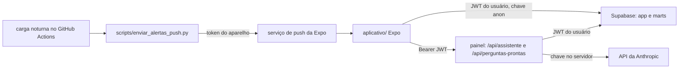
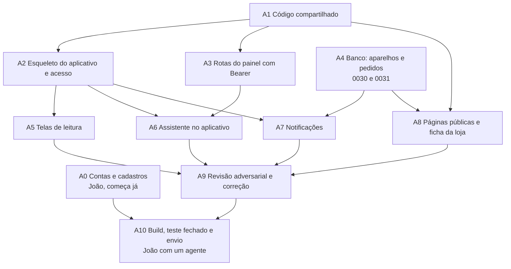

# Plano: primeira versão do aplicativo na App Store e no Google Play

02/10/2026. Pedido de João Cosme. Escrito para os mesmos agentes executores do `docs/plano_implementacao.md`: vale tudo da seção 1 daquele plano (ordem de leitura, regras que o executor nunca quebra, worktree por pacote, no máximo três agentes por vez, ninguém faz commit). Em conflito, `CLAUDE.md` vence.

O aplicativo estava fora do MVP (`plano_implementacao.md`, seção 2). Este plano não muda os prazos da demo nem das entregas 1 e 2; a seção 6 diz onde ele cabe.

## 1. O que vai para a loja

Um aplicativo para iPhone e Android, só de leitura, para os mesmos usuários e perfis do painel. A conta continua nascendo por convite no painel; o aplicativo não cadastra ninguém.

Entra na versão 1.0:

1. Entrar com e-mail e senha, segundo fator por aplicativo autenticador para diretor e financeiro (cadastrar e verificar), sair.
2. Carteira: os números de `marts.posicao_carteira` e a lista de alertas, com a data da última carga.
3. Obras: lista das obras que o RLS libera e, em cada uma, posição financeira (`marts.posicao_financeira_obra`), fluxo mensal resumido (`marts.fluxo_caixa_mensal`) e resumo do estoque.
4. Assistente: perguntas prontas e texto livre, pela mesma rota do painel.
5. Notificação quando a carga noturna gera alerta novo, sem valor no texto.
6. Desbloqueio por Face ID, digital ou senha do aparelho ao voltar para o aplicativo, com o conteúdo escondido no alternador de apps.
7. Ajustes: política de privacidade, pedido de exclusão da conta, versão e data da carga.

Fica para depois: simulação de vendas, mapa de unidades, conferência com o ERP, comparativo entre obras, relatório impresso, funil e leads, uso sem internet, iPad e tablet com layout próprio, troca de senha dentro do aplicativo (abre o painel no navegador).

Os itens 5 e 6 seguram a aprovação. A Apple recusa, pela diretriz 4.2 (funcionalidade mínima), aplicativo que só repete o site, e notificação e biometria são o que o site não faz.

## 2. Decisões que João fecha antes da onda 1

| Decisão | Recomendação | Por quê | Alternativa e custo dela |
| --- | --- | --- | --- |
| D1. Tecnologia | Expo (React Native) com TypeScript e Expo Router, em `aplicativo/` | O `supabase-js` roda igual no aparelho, a sessão fica no Keychain e no Keystore, e o EAS gera e envia os dois binários sem Android Studio. O RLS e a barreira da 0022 já valem para token usado fora do painel | Capacitor abrindo o site: menos código, mas alto risco de recusa na 4.2, cookie de sessão do SSR dentro de WebView e CSP com nonce dão trabalho. PWA não entra em loja |
| D2. Conta de desenvolvedor | Pessoa jurídica (a empresa de João, que é quem assina a parceria) nas duas lojas | Nome da empresa aparece como vendedor; no Google, conta de organização não passa pelo teste fechado obrigatório | Pessoa física sai em dias, mas o nome de João aparece na loja e o Google exige teste fechado com 12 testadores por 14 dias seguidos antes de liberar produção (vale para conta pessoal criada depois de 13/11/2023) |
| D3. Listagem | Pública nas duas lojas, com login por convite | Braga vai mostrar a construtoras; achar pelo nome ajuda. Revisão da Apple aceita app só com login se houver conta de demonstração | Apple "Unlisted" ou app personalizado pelo Apple Business Manager; Google privado por Managed Play. Bom para cliente único, ruim para venda |
| D4. Conta do revisor | Usuário `revisor.loja@<domínio da empresa>` com perfil `leitura` no tenant da demo, vinculado às três obras, no projeto que o aplicativo de produção usa | Revisor não consegue gerar código TOTP; `leitura` não passa pela barreira e vê dado fictício | Diretor com TOTP e chave nas notas de revisão: expõe segredo e costuma travar a revisão |
| D5. Texto da notificação | Sem valor e sem nome de obra: "Há um alerta novo numa obra. Abra para ver." | Tela bloqueada é lida por qualquer um. É a mesma dúvida em aberto do resumo semanal por e-mail | Com o nome da obra, depois de os sócios decidirem |
| D6. Quando construir | Contas e cadastros agora; código depois da entrega 2 (a partir de 22/02/2027) | O aplicativo não está nas 20 h semanais do MVP. Cadastro de D-U-N-S e conta de empresa demoram semanas e não gastam hora de desenvolvimento | Em paralelo com o MVP: empurra a entrega 2 em cinco a oito semanas |

Sem D1 e D2 respondidas nenhum agente começa. D3 a D5 podem ser fechadas até a onda 3.

## 3. Arquitetura

1. Leitura de dado: o aplicativo consulta `app` e `marts` direto com `supabase-js`, a chave `anon` e o JWT do usuário. Nada novo precisa ficar exposto na API.
2. Assistente: continua no painel, porque a chave da Anthropic e a chave de assinatura da 0025 só existem no servidor. O aplicativo manda `Authorization: Bearer <access_token>`; a rota valida com `getClaims()` e cria o cliente do Supabase com esse token.
3. Regras que precisam dar o mesmo resultado nas duas pontas (formatação em real, textos de explicação, idade da carga, decisão do segundo fator, texto dos alertas, mensagens de erro) saem de `painel/lib/` para `compartilhado/`, TypeScript puro sem dependência. Painel e aplicativo importam do mesmo arquivo.
4. Sessão: o token do Supabase passa do limite de 2 KB do `expo-secure-store`. O armazenamento usa uma chave AES guardada no SecureStore e o conteúdo cifrado no AsyncStorage, como no guia da Expo para Supabase. O AsyncStorage nunca guarda a sessão em claro.
5. Variáveis do aplicativo com prefixo `EXPO_PUBLIC_` vão para dentro do binário e qualquer um extrai. Entram só `EXPO_PUBLIC_SUPABASE_URL`, `EXPO_PUBLIC_SUPABASE_ANON_KEY` e `EXPO_PUBLIC_URL_PAINEL`. `service_role`, chave da Anthropic e chave de assinatura ficam de fora.
6. Perfis do EAS: `desenvolvimento` e `previa` apontam para o banco de teste; `producao` aponta para o projeto de produção. Mesma regra do preview da Vercel.

## 4. Grafo de agentes

Ondas, com no máximo três agentes ao mesmo tempo:

| Onda | Agentes | Termina quando |
| --- | --- | --- |
| 0 | A0 (João) | Contas aprovadas nas duas lojas; pode correr durante todo o MVP |
| 1 | A1, A4 | Painel compila e passa nos testes importando de `compartilhado/`; 0030 e 0031 com pgTAP verde |
| 2 | A2, A3, A8 | Login com os dois perfis no simulador; rotas aceitam Bearer; páginas públicas no ar na prévia da Vercel |
| 3 | A5, A6, A7 | Telas, assistente e notificação funcionando no aparelho de João com o banco de teste |
| 4 | A9 | Achados confirmados corrigidos e tudo rodado de novo |
| 5 | A10 | Aplicativo aprovado nas duas lojas |

Cada agente trabalha só nos arquivos da sua linha. Para verificar em banco, um único Supabase local, com a trava por `mkdir` atômico do `plano_origens.md`, para dois agentes não rodarem `supabase db reset` juntos. Os números 0030 e 0031 ficam reservados; não existe 0028 e ela não deve ser criada.

## 5. Pacotes

### A0. Contas e cadastros (João)

Objetivo: tudo que depende de pessoa, documento ou espera pronto antes de haver binário.

1. D-U-N-S da empresa, pelo formulário da Apple para desenvolvedores. É gratuito e a liberação pode levar semanas; pedir primeiro.
2. Apple Developer Program como organização (US$ 99 por ano), com o D-U-N-S. Criar o app no App Store Connect com o bundle `br.com.<empresa>.obraanalitica` e reservar o nome "Obra Analítica".
3. Google Play Console como organização (US$ 25 uma vez), com o mesmo identificador de pacote. Se D2 for pessoa física, montar já a lista de 12 testadores que vão ficar 14 dias seguidos no teste fechado: se a contagem cair abaixo de 12, o prazo volta a zero.
4. Conta na Expo para o EAS, com autenticação em dois fatores. Ligar as contas da Apple e do Google ao EAS Submit com chave de API do App Store Connect e conta de serviço do Google, nunca com senha pessoal.
5. E-mail de suporte e de privacidade no domínio da empresa, e o nome do encarregado de dados para a política (LGPD).
6. Usuário revisor da D4, criado e vinculado como na seção 6 de `docs/operacao/publicar-demo.md`, com perfil `leitura` e as três obras. A senha vai só para o campo de notas do App Store Connect e do Play Console.
7. Sócios leem e aprovam o texto da política de privacidade que o A8 escrever.

Aceite: as duas contas ativas, app criado nas duas lojas, revisor entra no painel e vê as três obras.

Horas: 6 a 10 de João, mais a espera do D-U-N-S.

### A1. Código compartilhado

Objetivo: regras puras do painel num lugar que o aplicativo também importa, sem mudar comportamento do painel.

Depende de: D1.

Arquivos exclusivos: `compartilhado/**` (novo), os arquivos movidos de `painel/lib/` (`formatar.ts`, `explicacoes.ts`, `idade-carga.ts`, `mensagens.ts`, `alertas.ts`, `supabase/nivel-acesso.ts` e as funções puras de `consultas/resumo-origem.ts` que `alertas.ts` usa), as linhas de `import` dos arquivos do painel que usam esses módulos, `painel/tsconfig.json`, `painel/next.config.ts`, `painel/vitest.config.ts`.

Passos:

1. Mover com `git mv` para manter o histórico. Não copiar o arquivo nem deixar no lugar antigo um arquivo que só reexporta.
2. Alias `@compartilhado/*` no `tsconfig.json` do painel. Ler em `painel/node_modules/next/dist/docs/` como a versão instalada do Next resolve arquivo fora da raiz do projeto (`turbopack.root` e `outputFileTracingRoot`) antes de mexer no `next.config.ts`.
3. Os testes desses módulos continuam em `painel/testes/` e passam a importar de `@compartilhado`.
4. Confirmar na Vercel que o projeto, com Root Directory `painel`, inclui arquivos fora da raiz no build. Se a opção estiver desligada, parar e avisar João.

Aceite: `npm run lint`, `npx tsc --noEmit`, `npx vitest run` e `npm run build` verdes no painel; prévia da Vercel abre todas as telas; `grep -r "server-only\|next/\|react" compartilhado/` não acha nada.

Não fazer: mover arquivo que importa `server-only`, Next, React, Sentry ou `supabase-js`; mudar texto ou regra no caminho.

Horas: 6 a 10.

### A2. Esqueleto do aplicativo e acesso

Objetivo: projeto Expo que entra, cumpre o segundo fator igual ao painel e sai.

Depende de: A1, D1, D2.

Arquivos exclusivos: `aplicativo/**` menos `aplicativo/app/(abas)/**`, `aplicativo/lib/consultas/**`, `aplicativo/lib/assistente/**` e `aplicativo/lib/notificacoes/**`; o job `aplicativo` em `.github/workflows/ci.yml`.

Passos:

1. `npx create-expo-app@latest aplicativo` com o modelo TypeScript, na versão estável do dia, travada no `package-lock.json`. Ler a documentação dessa versão do SDK antes de escrever código, como o `painel/AGENTS.md` pede para o Next.
2. `app.config.ts` com nome "Obra Analítica", bundle e pacote da A0, `ITSAppUsesNonExemptEncryption: false` (só HTTPS padrão), manifesto de privacidade do iOS com as APIs de motivo obrigatório que as bibliotecas declararem, orientação retrato, ícone e tela inicial na paleta tijolo do `CONTEXTO.md`.
3. `eas.json` com os perfis `desenvolvimento`, `previa` e `producao` da seção 3, `autoIncrement` do número de build e versão `1.0.0`.
4. `aplicativo/lib/supabase/cliente.ts` com o armazenamento cifrado da seção 3, `autoRefreshToken` ligado só com o aplicativo em primeiro plano.
5. Telas `entrar`, `segundo-fator/cadastrar` e `segundo-fator/verificar` usando `supabase.auth.mfa`, e a decisão de destino de `@compartilhado/nivel-acesso`. Perfil que não se consegue ler conta como perfil que exige o fator, como no painel.
6. Bloqueio com `expo-local-authentication` ao voltar do segundo plano depois de cinco minutos, e conteúdo coberto no alternador de apps. O bloqueio só protege a sessão guardada; não substitui o `aal2`.
7. Sentry para React Native com o mesmo filtro de dado pessoal de `filtro-sentry.ts`, sem e-mail, token nem corpo de resposta.
8. Job `aplicativo` no CI: `npm ci`, lint, `npx tsc --noEmit`, testes com `jest-expo`, `npm audit --audit-level=moderate`, `npx expo-doctor`.

Aceite: no simulador do iOS e no emulador do Android, a gerente de teste entra e vê a carteira vazia de propósito; o diretor de teste cadastra o autenticador e entra; com só a senha, o diretor não lê nenhuma linha de `marts` (a 0022 barra); sair apaga a sessão guardada.

Testes: unidade da decisão de destino com os mesmos casos de `painel/testes/nivel-acesso.test.ts`; fumaça de login com Maestro no Mac de João, roteiro em `aplicativo/testes/e2e/`.

Não fazer: `getSession()` para decidir permissão; guardar senha; chave secreta em `EXPO_PUBLIC_`; `console.log`.

Horas: 16 a 24.

### A3. Rotas do painel com Bearer

Objetivo: o aplicativo usa o assistente e as perguntas prontas sem cookie.

Depende de: A1.

Arquivos exclusivos: `painel/lib/supabase/cliente-requisicao.ts` (novo), `painel/app/api/assistente/route.ts`, `painel/app/api/perguntas-prontas/route.ts` (novo), `painel/lib/consultas/perguntas-prontas.ts` (só para receber o cliente por parâmetro), testes novos em `painel/testes/`.

Passos:

1. `cliente-requisicao.ts`: com `Authorization: Bearer`, cria o cliente com o token no cabeçalho global e valida por `getClaims()`; sem ele, usa os cookies como hoje. Cabeçalho mal formado ou token inválido devolve 401, sem cair para os cookies.
2. As duas rotas passam a usar esse cliente e conferem sessão, perfil e `aal` dentro delas, com `decidirDestino`. A cota por usuário da 0023 continua valendo.
3. `POST /api/perguntas-prontas` recebe só o `id` de uma pergunta do catálogo fechado e devolve colunas e linhas. Id fora do catálogo é 400.
4. Requisição sem `Origin` (aplicativo) e com `Origin` do próprio painel passam; qualquer outro `Origin` com Bearer é 403.

Aceite: Vitest cobre Bearer válido, vencido, de outro projeto, ausente, e cookie como antes; o Playwright atual continua verde.

Não fazer: abrir CORS com `*`; aceitar SQL vindo do aplicativo; devolver mensagem com nome de tabela.

Horas: 6 a 10.

### A4. Banco: aparelhos e pedidos de exclusão

Objetivo: guardar onde mandar notificação, não repetir notificação e registrar pedido de exclusão de conta.

Depende de: nada.

Arquivos exclusivos: `supabase/migrations/0030_dispositivo_notificacao.sql`, `supabase/migrations/0031_pedido_exclusao_conta.sql`, `supabase/tests/dispositivo_notificacao.sql`, `supabase/tests/pedido_exclusao_conta.sql`.

Passos:

1. 0030: `app.dispositivo_notificacao` (`user_id`, `tenant_id`, `token_push` único, `plataforma`, `criado_em`, `visto_em`). RLS ligado e forçado; uma política por ação: o usuário insere, lê e apaga só as linhas dele; não atualiza. Índice em `user_id`. A restritiva `segundo_fator` da 0022 nasce nesta tabela também, senão o `segundo_fator_rls.sql` acusa.
2. 0030: `app.alerta_notificado` (`tenant_id`, `centro_custo_id`, `tipo_alerta`, `data_carga`, chave única nas quatro). Sem política para `authenticated`: só a carga lê e grava.
3. 0030: `app.alertas_para_notificar()`, `security definer`, `search_path = ''`, `revoke execute from public, anon, authenticated`. Uma consulta só, por conjunto: alertas da última carga que ainda não estão em `alerta_notificado`, cruzados com `usuario_tenant` e `usuario_centro_custo` pela mesma regra de `obras_permitidas()`, devolvendo `token_push` e nada de valor.
4. 0031: `app.pedido_exclusao_conta` (`user_id`, `tenant_id`, `pedido_em`, `atendido_em`). O usuário insere e lê o próprio pedido; atendimento é pelo administrador da construtora no SQL Editor, porque a conta pertence à empresa.

Aceite: pgTAP prova que um usuário não lê o aparelho de outro, que gerente não recebe alerta de obra que não vê, que rodar a função duas vezes depois de marcar notificado devolve vazio, e que `anon` e `authenticated` não executam a função.

Horas: 6 a 10.

### A5. Telas de leitura

Objetivo: carteira, obras e obra no aplicativo, com os mesmos números do painel.

Depende de: A2.

Arquivos exclusivos: `aplicativo/app/(abas)/index.tsx`, `aplicativo/app/(abas)/obras/**`, `aplicativo/app/(abas)/alertas.tsx`, `aplicativo/lib/consultas/**`, `aplicativo/componentes/**` novos dessas telas, testes.

Passos:

1. Uma consulta por tela, com as mesmas colunas que `painel/lib/consultas/` lê. O aparelho não soma linha a linha; a soma já vem das views.
2. Toda tela mostra a data da última carga com `@compartilhado/idade-carga` e formata real com `@compartilhado/formatar`.
3. Gráfico do fluxo mensal com biblioteca que rode no React Native, cores de `painel/lib/cores-grafico.ts` copiadas para um tema do aplicativo; ler a skill `dataviz` antes.
4. Puxar para atualizar; sem cache em disco de valor financeiro.
5. Toque no indicador abre a frase de `@compartilhado/explicacoes`.

Aceite: com a carga da demo no banco de teste, carteira e cada obra batem centavo a centavo com o painel; gerente vê uma obra, diretor três; cada tela abre em menos de 2 s em 4G no aparelho de João; VoiceOver e TalkBack leem rótulo e valor de cada cartão; texto aumenta até 200% sem cortar número.

Horas: 20 a 30.

### A6. Assistente no aplicativo

Objetivo: perguntas prontas e texto livre no aparelho.

Depende de: A2, A3.

Arquivos exclusivos: `aplicativo/app/(abas)/assistente.tsx`, `aplicativo/app/consentimento-assistente.tsx`, `aplicativo/lib/assistente/**`, testes.

Passos:

1. Antes da primeira pergunta, uma tela diz que a pergunta e o resultado da consulta vão para um provedor de IA (Anthropic) para montar a resposta, e pede consentimento. Sem consentimento, só perguntas prontas, que não passam pelo modelo. As diretrizes da Apple pedem aviso e permissão explícita antes de mandar dado pessoal a IA de terceiro; conferir o texto vigente na 5.1.2 antes de entregar.
2. Chamadas com Bearer para as rotas do A3, com o `id_requisicao` devolvido aparecendo no erro para suporte.
3. Resposta mostra a tabela que veio do banco e o texto; erro de cota mostra quando volta a funcionar.

Aceite: pergunta pronta e pergunta livre respondem com número igual ao do painel; quem recusou o consentimento não chega à rota de texto livre; a 31ª pergunta da hora recebe a mensagem de cota.

Horas: 8 a 12.

### A7. Notificações

Objetivo: aviso no aparelho quando a carga gera alerta novo.

Depende de: A2, A4.

Arquivos exclusivos: `aplicativo/lib/notificacoes/**`, a tela de ajustes de notificação, `scripts/enviar_alertas_push.py`, `scripts/testes/teste_enviar_alertas_push.py`, o passo novo em `.github/workflows/carga_noturna.yml`, `requirements.txt` se precisar de pacote novo.

Passos:

1. O aplicativo pede permissão só quando o usuário liga a opção em Ajustes, não na primeira abertura. Grava o token em `app.dispositivo_notificacao` e apaga ao sair.
2. O script chama `app.alertas_para_notificar()` uma vez, agrupa por token, manda em lotes de até 100 para o serviço de push da Expo e grava em `alerta_notificado` na mesma transação que confirma o envio. Rodar duas vezes não manda duas vezes.
3. Recibo com `DeviceNotRegistered` apaga o token. Log sem token e sem e-mail.
4. Texto conforme D5. Tocar na notificação abre a aba de alertas.
5. O passo só roda depois de a carga terminar com sucesso.

Aceite: com a carga da demo, a Parque das Águas gera alerta e o aparelho de João recebe uma notificação só, mesmo rodando o job duas vezes; gerente da Aurora não recebe; teste Python com servidor falso cobre lote, recibo de token morto e nova execução.

Horas: 10 a 16.

### A8. Páginas públicas e ficha da loja

Objetivo: tudo que as lojas pedem fora do binário.

Depende de: A1, A4.

Arquivos exclusivos: `painel/app/privacidade/page.tsx`, `painel/app/excluir-conta/page.tsx`, `painel/app/suporte/page.tsx`, as três rotas na lista sem barreira de `compartilhado/nivel-acesso.ts`, `docs/loja/**`.

Passos:

1. Política de privacidade em português: o que se coleta (e-mail, identificador do usuário, perguntas ao assistente e a consulta gerada, token de notificação, falhas pelo Sentry), para quê, onde fica, quem recebe (Supabase, Vercel, Anthropic, Expo, Sentry), por quanto tempo, como pedir exclusão, encarregado de dados. CPF, renda, score e dado bancário não são coletados.
2. Página de exclusão de conta com o caminho dentro do aplicativo e o contato, para o link que o Google pede.
3. `docs/loja/ficha.md`: nome, subtítulo, descrição curta e longa, palavras-chave, categoria (Negócios), classificação etária, URLs de suporte e privacidade, lista das capturas por tamanho de tela.
4. `docs/loja/privacidade.md`: respostas prontas para os rótulos de privacidade da Apple e para a seção Segurança dos dados do Google, item por item, todas "vinculado ao usuário, não usado para rastreamento".
5. `docs/loja/notas-revisao.md`: para que serve o aplicativo, por que não tem cadastro, conta do revisor (sem senha no arquivo), onde ver notificação e biometria, aviso de que os dados do revisor são fictícios.
6. Todo texto passa pelo /humanizer.

Aceite: as três páginas abrem sem login na prévia da Vercel, com os cabeçalhos de segurança de sempre; o Playwright prova que elas não abrem nenhuma outra rota sem login.

Horas: 8 a 12.

### A9. Revisão adversarial e correção

Objetivo: quebrar a entrega antes da Apple e do Google.

Depende de: A5, A6, A7, A8.

Três revisores com lentes diferentes, cada um entrega achados com passo para reproduzir:

1. Segurança do aplicativo e das rotas: token fora do armazenamento cifrado, chave no binário (extrair o `.ipa` e o `.aab` e procurar), Bearer aceito sem validação, diretor lendo dado em `aal1`, log com dado pessoal, notificação vazando valor.
2. Conformidade com as lojas: diretrizes da Apple vigentes (4.2, 5.1.1, 5.1.2, 2.1 sobre conta de demonstração), políticas do Google Play (Segurança dos dados, exclusão de conta, nível de API exigido no ano), manifesto de privacidade, permissões pedidas sem uso.
3. Usabilidade e textos: português claro, erro que diz o que fazer, VoiceOver, TalkBack, contraste AA, fonte grande, aparelho pequeno.

Um quarto agente corrige o que for confirmado e roda tudo de novo. Achado que muda escopo vai para João.

Horas: 8 a 12.

### A10. Build, teste fechado e envio

Objetivo: aplicativo aprovado nas duas lojas.

Depende de: A0, A9.

1. `eas build --profile producao --platform all`. Conferir o número da versão e o banco de produção nas variáveis do perfil.
2. TestFlight interno e teste interno do Google com João, Braga e o revisor por uma semana. Se D2 for pessoa física, o teste fechado de 12 pessoas por 14 dias começa aqui e é o caminho crítico.
3. Capturas de tela com a conta do revisor, dados fictícios.
4. `eas submit` para as duas lojas, com as notas do A8.
5. Recusa: o agente lê o motivo, propõe a correção mínima, João aprova e sai um build novo. Responder ao revisor só depois de corrigir.
6. Liberação manual depois da aprovação, em dia útil, com João acompanhando o Sentry nas primeiras 24 h.

Aceite: link público nas duas lojas; revisor entra pelo aplicativo baixado da loja; `CONTEXTO.md` atualizado.

Horas: 8 a 14, mais a espera das revisões.

## 6. Prazo e custo

Horas dos agentes com revisão de João: 102 a 160, ou cinco a oito semanas a 20 h por semana.

| Cenário | Código começa | Loja | Efeito no MVP |
| --- | --- | --- | --- |
| Recomendado | 22/02/2027, depois da entrega 2 | fim de março ou começo de abril de 2027, com conta de empresa | nenhum |
| Em paralelo | 19/10/2026 | perto da entrega 2 | entrega 2 passa para março ou abril de 2027 |

Com conta pessoal no Google, somar pelo menos três semanas no Android (montar os 12 testadores, 14 dias seguidos, revisão do pedido de produção).

Custo novo:

| Item | Valor | Quando |
| --- | --- | --- |
| Apple Developer Program | US$ 99 por ano | na A0 |
| Google Play Console | US$ 25 uma vez | na A0 |
| EAS | plano gratuito, se a cota mensal de builds bastar (conferir na hora) | onda 2 em diante |
| Serviço de push da Expo | sem custo | onda 3 |
| Mac | já existe | |

## 7. Antes de cada entrega

O agente responde a lista da seção 10 do `plano_implementacao.md`, as perguntas de eficiência do `CLAUDE.md` e mais estas:

1. Nenhuma chave secreta em `EXPO_PUBLIC_` nem no binário.
2. Sessão só no armazenamento cifrado.
3. Número na tela do aplicativo igual ao do painel, conferido com a carga da demo.
4. Tela nova com data da carga, real formatado, leitor de tela e fonte grande testados.
5. Permissão do aparelho pedida só quando o usuário usa a função.
6. Arquivos alterados todos dentro dos exclusivos do pacote.
7. Comandos para João, na ordem.
