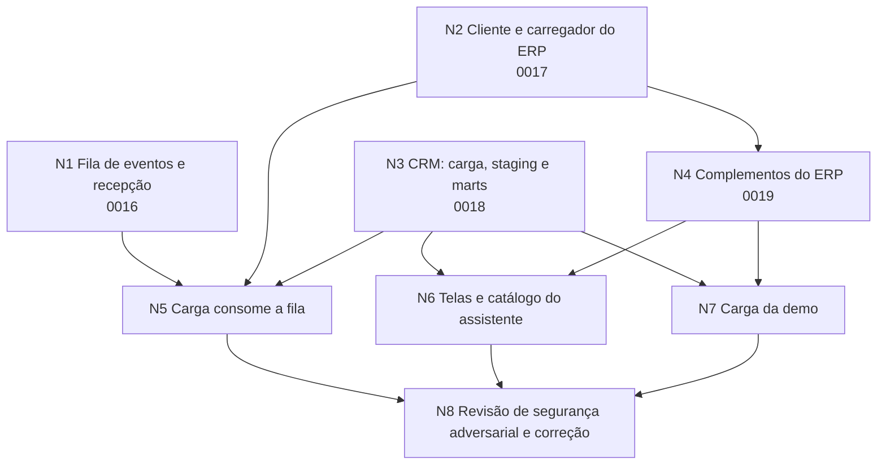

# Plano de ação: carga real do ERP, eventos e CRM como segunda origem

28/09/2026. Parte das skills `erp-origem-api` e `crm-vendas-api` e executa o que dá para construir sem acesso à API do piloto: tudo é testado contra dado sintético e servidor falso. O PT-09 continua dependendo da sondagem real no Mac.

## Grafo

Cada nó é um agente com arquivos exclusivos. Nenhum agente edita arquivo de outro nó nem migration já aplicada. A verificação em banco usa um único Supabase local, com trava (`mkdir` atômico) para que dois agentes não rodem `supabase db reset` ao mesmo tempo. Ninguém faz commit.

## Nós

| Nó | Entrega | Arquivos |
|---|---|---|
| N1 | Tabelas `app.webhook_origem` (hash do token por tenant e origem) e `app.evento_origem` (fila com chave única por evento). Função `app.registrar_evento_origem`, `security definer`, chamável só por `anon`, que valida o token pelo hash, confere o tipo de evento numa lista fechada, limita eventos por minuto e grava só IDs. Rotas `api/origem/erp` (Bearer) e `api/origem/crm/[chave]` (token na URL, porque o CRM não autentica o disparo). Script que gera o token, grava o hash e cadastra o hook | `0016_eventos_origem.sql`, `painel/app/api/origem/**`, `painel/lib/eventos-origem.ts`, `scripts/cadastrar_webhooks.py`, testes |
| N2 | Cliente HTTP com Basic ou OAuth por variável, limitador de 200 por minuto, contador da cota diária, 429 com `Retry-After`, paginação, Bulk síncrono e assíncrono por chunk, e caminho só REST quando o pacote não tem Bulk. Lista de campos permitidos por endpoint (LGPD). Carregador incremental: `changeStartDate` no `income`, `modifiedAfter` nos contratos, `bills/by-change-date` mais `outcome/by-bills` no a pagar. Marca de carga por tenant e endpoint | `0017_marca_carga.sql`, `scripts/cliente_origem.py`, `scripts/campos_permitidos.py`, `scripts/carregar_origem.py`, `docs/decisoes/0005-carga-incremental.md`, testes |
| N3 | Carga do CVDW (repasses, reservas, vínculo com o ERP) por `a_partir_data_referencia`, com lista de campos permitidos. Gerador sintético coerente com os contratos da demo. `staging.repasse`, `staging.reserva`, `marts.repasse_obra` (etapa, valor e tempo do repasse real) e `marts.funil_vendas_mensal` | `0018_crm.sql`, `scripts/cliente_crm.py`, `scripts/carregar_crm.py`, `scripts/gerar_dados_crm.py`, `dados/crm/`, `docs/decisoes/0006-crm-segunda-origem.md`, testes |
| N4 | Mapa imobiliário consolidado (conferência do VGV, custo incorrido e margem contra o ERP), medição física por obra, inadimplência por faixa de atraso | `0019_complementos_origem.sql`, `scripts/gerar_dados_complementares.py`, `dados/complementos/`, endpoints novos em `carregar_origem.py`, testes |
| N5 | A carga lê os eventos pendentes, busca só os IDs sujos e marca processado | `carregar_origem.py`, `carregar_crm.py` |
| N6 | Telas de repasse e funil na obra, execução física, conferência com o ERP; entradas novas no catálogo do assistente | `painel/app/(painel)/obras/[id]/**`, `painel/lib/consultas/*` novos, `painel/lib/catalogo-views.ts`, testes |
| N7 | `carregar_demo.py` grava os arquivos novos e chama as recargas novas | `scripts/carregar_demo.py` |
| N8 | Três revisores com lentes diferentes (banco e RLS, rotas e webhooks, LGPD e carga) tentam quebrar a entrega; um agente corrige o que for confirmado e roda tudo de novo | qualquer arquivo tocado acima |

## Premissas de segurança aplicadas

- `service_role` fica só na carga (GitHub Actions). A recepção de webhook na Vercel usa a chave `anon` e uma função `security definer` com `search_path = ''`, que só aceita token válido.
- Token de webhook nunca é gravado em claro nem impresso; o banco guarda o SHA-256. Comparação em tempo constante.
- Corpo do webhook é aviso não confiável. Só IDs de uma lista fechada entram na fila; o dado vem da API na carga seguinte.
- Tabela nova com RLS ligado e forçado na mesma migration, uma política por ação, view com `security_invoker`.
- CPF, nome, e-mail, telefone, renda, score e dado bancário saem no carregador por lista de campos permitidos, antes de gravar em `raw`.
- Carga idempotente: rodar duas vezes não duplica (`hash_registro`, fila com chave única, marca de carga só avança no fim).
- Erro para o usuário sem stack, SQL ou nome de tabela.

## Fora deste plano

- Sondagem real e conciliação com o controller (PT-09, passos 1 e 5).
- `app.carga_execucao` e o job noturno (PT-08, migration 0014).
- Validador com parser (PT-07, branch própria).
